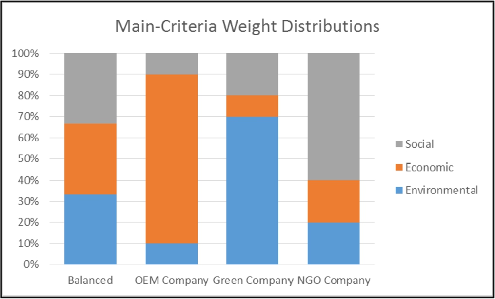
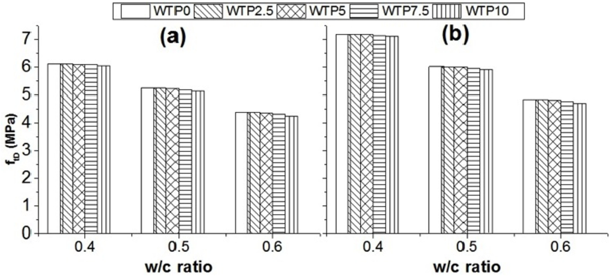

# Image-Color-Classifier

## Classification 

A simple script to segregate if a image is color or grayscale:
 * Calculates the absolute pixel value difference between red, green and blue.
 * These values are added to calculate ``` diff ``` variable.
 * To classify images as gray or color ``` diff ``` is divided by product of ``` width * height ```.

## Thresholding

Currently the threshold is set to be **1**, but can be optimized based on the dataset available.

## Dataset

Images can be found in ``` ~/Train ```  and ``` ~/Test ``` folder. Samples include:

Color                                            |  Gray
:-----------------------------------------------:|:-------------------------:
  |  

This dataset was given for Springer hackathon held in Pune, India.
